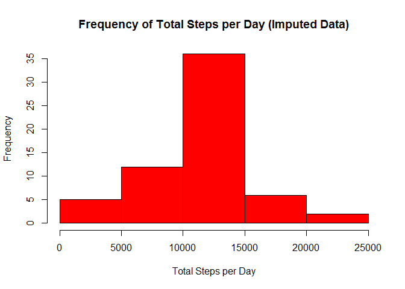
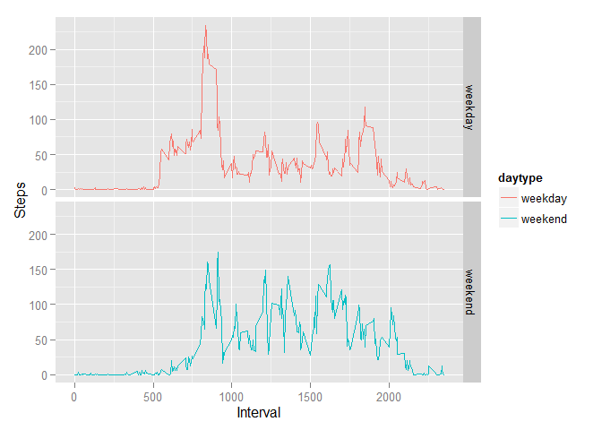

# Reproducible Research: Peer Assessment 1

```r
## Loading and preprocessing the data
rawdata <- read.csv("./activity/activity.csv")

# Remove days of NA data from original/raw data
data <- rawdata[complete.cases(rawdata),]
```


## What is mean total number of steps taken per day?
1.  Total steps taken per day:

```r
library(dplyr)
```

```
## 
## Attaching package: 'dplyr'
## 
## The following object is masked from 'package:stats':
## 
##     filter
## 
## The following objects are masked from 'package:base':
## 
##     intersect, setdiff, setequal, union
```

```r
library(chron)

#1. Total steps per day
steps.per.day <- summarize(group_by(data,date),sum(steps))
steps.per.day
```

```
## Source: local data frame [53 x 2]
## 
##          date sum(steps)
## 1  2012-10-02        126
## 2  2012-10-03      11352
## 3  2012-10-04      12116
## 4  2012-10-05      13294
## 5  2012-10-06      15420
## 6  2012-10-07      11015
## 7  2012-10-09      12811
## 8  2012-10-10       9900
## 9  2012-10-11      10304
## 10 2012-10-12      17382
## ..        ...        ...
```

2. Histogram of steps per day

```r
#2. Histogram of steps per day
hist(steps.per.day$"sum(steps)",col="red",xlab="Total Steps per Day",
     main="Frequency of Total Steps per Day")
```

 

3. Mean and median of the total number of steps taken per day


```r
#3. Mean and median of total steps per day
mean.steps.per.day <- summarize(steps.per.day,mean(steps.per.day$"sum(steps)"))
rounded.mean.steps.per.day <- round(mean.steps.per.day,digits=2)  #doesn't seem to affect knitr output format
median.steps.per.day <- summarize(steps.per.day,median(steps.per.day$"sum(steps)"))
```
The mean total number of steps taken per day is 1.076619\times 10^{4} 
and the median is 10765.  


## What is the average daily activity pattern?
1. Plot average steps taken per interval(x) vs. all days (y)


```r
#1. Plot average steps taken per interval(x) vs. all days (y)
avg.steps.per.interval <- summarize(group_by(data,interval),mean(steps))
avg.steps.per.interval$interval <- formatC(avg.steps.per.interval$interval, 
                                           width=4, format="d", flag="0")
avg.steps.per.interval$interval <- strptime(avg.steps.per.interval$interval,format="%H%M")
plot(avg.steps.per.interval$interval,avg.steps.per.interval$"mean(steps)",type="l",
     xlab="24 Hr. Time",ylab="Average Steps",main="Average Steps per Interval")
```

 

```r
#2. Maximum average 5-minute interval
max.avg.interval <- avg.steps.per.interval[which.max(avg.steps.per.interval$"mean(steps)"),]
```
2. The maximum average interval was at 2015-04-19 08:35:00 with value 206.1698113


## Imputing missing values
1. Calculate and report the total number of missing values in the dataset

```r
#1. Calculate and report the total number of missing values in the dataset
missing.values <- rawdata[!complete.cases(rawdata),]
number.missing.values <- length(missing.values$steps)
```

There are 2304 missing values in the dataset.


2. Devise a strategy for filling in all of the missing values in the dataset:

```r
#2. Fill in missing values with means from complete days' five-minute intervals
mean.steps.per.interval <- summarize(group_by(data,interval),mean(steps))
means.for.missing.values <- missing.values
match.indices <- match(means.for.missing.values$interval,mean.steps.per.interval$interval)
means.for.missing.values[,"steps"] <- mean.steps.per.interval[match.indices,"mean(steps)"]
```
The strategy used to fill in the missing values with means from complete days' five-minute intervals.


3. Create a new dataset that is equal to the original dataset but with the missing data filled in.

```r
#3. Create a new dataset that is equal to the original dataset but with the missing data filled in.
# Combined data subset with NAs removed with a data subset with means replacing the NAs
imputeddata <- rbind(data[,1:3],means.for.missing.values[,1:3])
```

4. Histogram for imputed data and mean and median

```r
#4. Histogram for imputed data and mean and median
imputed.steps.per.day <- summarize(group_by(imputeddata,date),sum(steps))

hist(imputed.steps.per.day$"sum(steps)",col="red",xlab="Total Steps per Day",
     main="Frequency of Total Steps per Day (Imputed Data)")
```

 

```r
# Impact of imputing missing on mean and median.
mean.imputed.steps.per.day <- summarize(imputed.steps.per.day,mean(imputed.steps.per.day$"sum(steps)"))
median.imputed.steps.per.day <- summarize(imputed.steps.per.day,median(imputed.steps.per.day$"sum(steps)"))

# Mean does not change (not surprising), but the median changes slightly from 10765 to 
# 10766.19 (which is the mean).
```
Mean does not change (not surprising), but the median changes slightly from 10765 to 
10766.19 (which is the mean)


## Are there differences in activity patterns between weekdays and weekends?
1.Create a new factor variable in the dataset with two levels – “weekday” and “weekend” indicating whether a given date is a weekday or weekend day.


```r
weekdays.data <- data
weekdays <- weekdays(as.Date(weekdays.data$date))
weekdays <- factor(weekdays)
weekdays.data <- cbind(weekdays.data,weekdays)

daytype <- ifelse(weekdays.data$weekdays=="Sunday"|
                    weekdays.data$weekdays=="Saturday"
                  ,"weekend", "weekday")
daytype <- as.factor(daytype)
str(daytype)
```

```
##  Factor w/ 2 levels "weekday","weekend": 1 1 1 1 1 1 1 1 1 1 ...
```


```r
# Add the factor to the data as a column
weekdays.data <- cbind(weekdays.data,daytype)
weekdays.avg.steps.per.interval <- summarize(group_by(weekdays.data,daytype,interval),mean(steps))

# Plot the results
library(ggplot2)
ggplot(weekdays.avg.steps.per.interval,aes(interval,weekdays.avg.steps.per.interval$"mean(steps)")) + geom_line(aes(color=daytype)) +
  facet_grid(daytype~.) + xlab("Interval") + ylab("Steps")
```

 

Yes, there is a difference in the patterns of steps between weekdays and weekends. On weekdays, there are more
steps taken early in the day, presumably as the subject is going to work, then fewer steps throughout the day.
On weekends, there are more steps taken in the core of the day and extending slightly longer into
the early evening, likely due to weekend activities.
